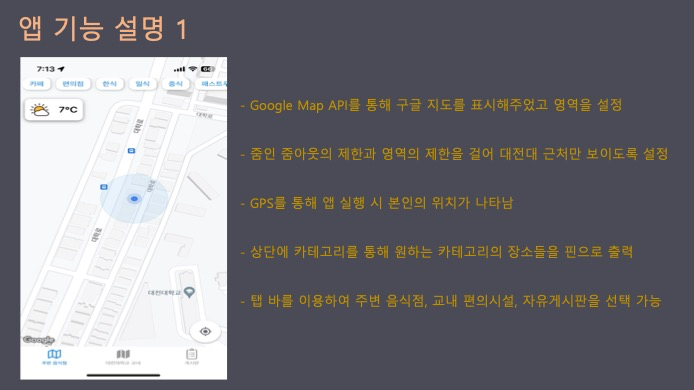
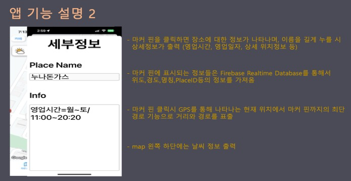
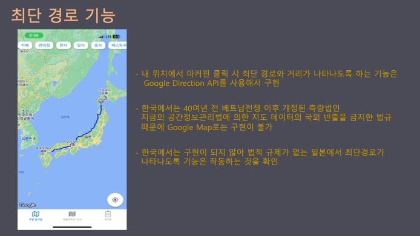

---

title : "DUI (Deajeon University Introduction app)"

---

## 프로젝트 : DUI (Deajeon University Introduction app)

포트폴리오 주소: https://github.com/nohhyeon/Fidecosemi.git

수행 기간: 2023.03 ~ 2023.11

수행 인원: 3명

###   프로젝트 목표/소개

신입생과 처음 학교를 방문한 사람들을 위해 학교의 편의시설을 쉽게 찾을 수 있도록 카테고리별로 장소를 나누고, 해당 카테고리를 누르면 마커핀을 통해 장소의 명칭과 위치를 확인할 수 있게 합니다. 또한, 마커핀을 길게 누르면 상세 정보 표시, 익명성을 보장하는 게시판 기능 제공.

###   개발 환경 (사용 도구/언어)

Firebase, Swift, CocoaPods, Firebase Realtime Database, Google Maps, Xcode, macOS

###   담당 역할

- 프로젝트 팀장으로서 iOS 앱의 전체적인 개발 구성과 기획

- Firebase Database를 사용하여 게시판과 Google Maps에서 마커핀 정보 출력 기능 구현

###   시연 영상

- [영상 1](https://www.youtube.com/shorts/PKLn743jEoM)

- [영상 2](https://www.youtube.com/shorts/HAFVg5ZxwcM)

수행 결과 화면 및 상세 설명

