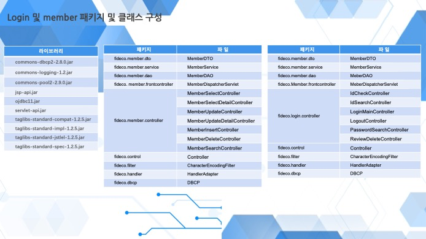
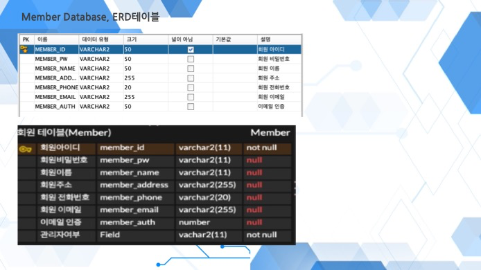
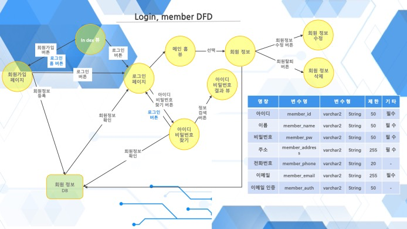
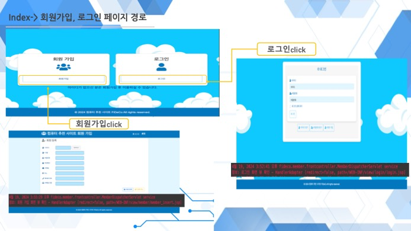
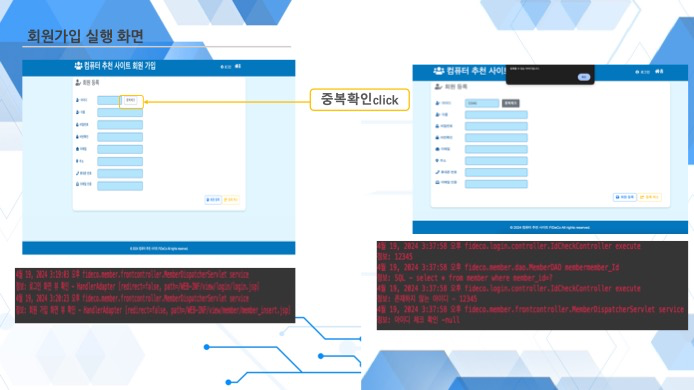
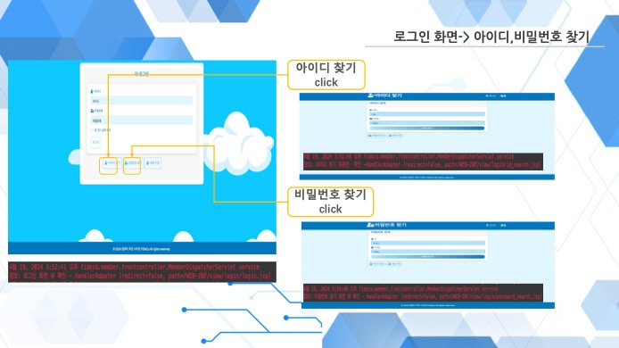
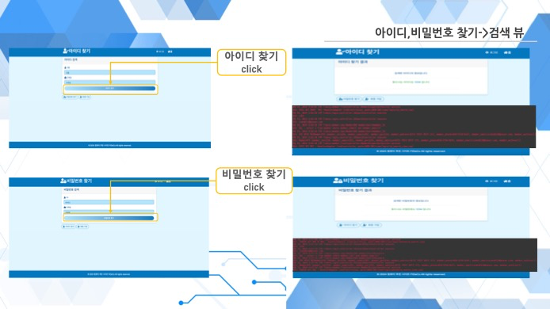
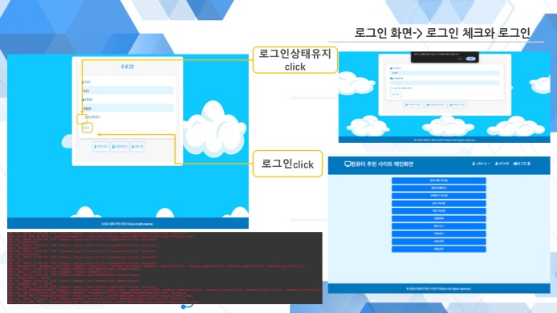
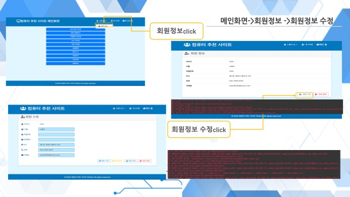

---

title : " MVC 프론트 컨트롤러 패턴을 활용한 컴퓨터 추천 웹 솔루션."

---

## 프로젝트 : MVC 프론트 컨트롤러 패턴을 활용한 컴퓨터 추천 웹 솔루션

포트폴리오 주소: https://github.com/nohhyeon/Fidecosemi.git

수행 기간: 2024.03 ~ 2024.04

수행 인원: 6명

### 프로젝트 목표/소개

컴퓨터 추천 사이트로, 가격대별 카테고리와 커뮤니티 사이트로 로그인과 게시판 기능 등 MVC 패턴 기반 CRUD 구현 프로젝트입니다.

### 개발 환경 (사용 도구/언어)

   Java EE, JavaScript, Spring Tools 4, Oracle, GitHub,  Apache Tomcat, Gradle, Apache Maven, SQL  

### 담당 역할

\- 프로젝트 PM으로서 로그인 및 회원가입의 CRUD 구현
 \- 오라클 DB를 이용하여 데이터 저장 및 확인을 통해 로그인과 회원가입 기능 구현
 \- 페이지 상단의 세션을 통해 로그인 유지 기능 구현
 \- 메인 화면에서 팀원들의 CRUD 기능 연동 및 매핑
 \- 회원정보 수정 및 탈퇴 기능 구현

### 기능 설명

\- 회원가입/로그인 선택: 아이디 중복 체크를 통해 Oracle DB의 아이디 확인 후 회원가입 가능
 \- 로그인 시 세션 유지 체크박스 설정
 \- 로그인 후 팀원들이 만든 기능 접근 가능
 \- 우측 상단에 로그인한 회원의 이름 표시
 \- 메인 화면에서 회원정보 클릭 시 정보 수정 가능

### 구성 및 실행 화면

